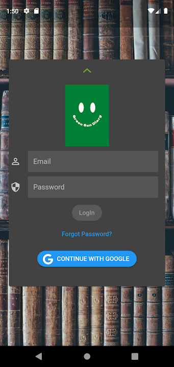
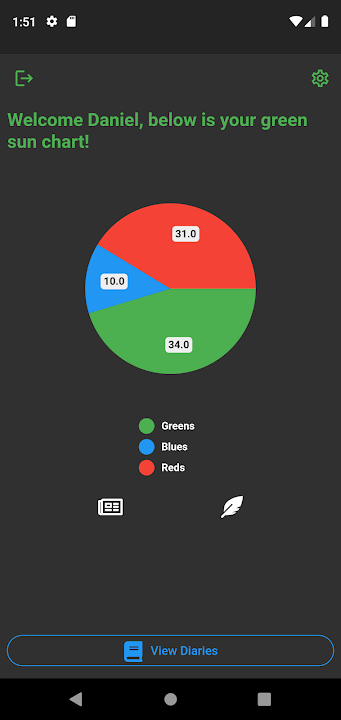

# Green Sun Diary

 

This is a mental health oriented diary entry application, made to help people monitor their mental health progress from every activity that they pertake in. We also offer users access to daily articles by people who went through challenging situations in life and are winning at the moment, those still trying to cope, and from experts in the industry. I made this application in honor of the Mental health awareness Month which runs from 1st to 31st May and probably beyond :)

This application helped me improve my understanding of flutter and the bloc pattern.
Feel free to experiment with it. In case you have any improvements, a PR is welcome. 

## Application download link
Click the icon to view the application on playstore.

